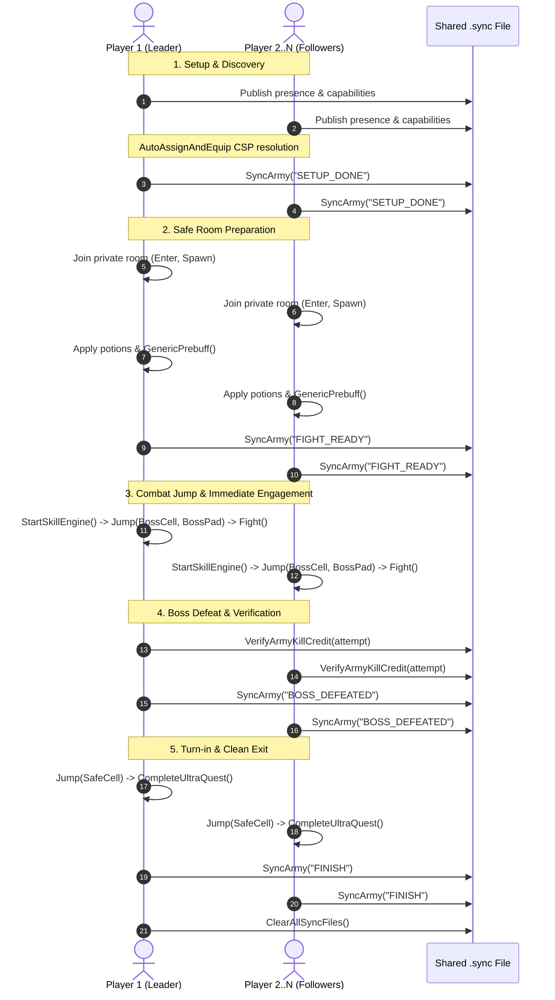

---
name: duck-ultra-scripting
description: >-
  Architectural manual, design patterns, and audit rules for writing, editing, and debugging
  multi-client AQW Ultra boss scripts in the DUCK framework (CoreDUCK.cs, 0AllUltrasDUCK.cs).
  Enforces lockstep synchronization rules, taunt engine concurrency, pad-agnostic room checking,
  diagnostic logging, and compilation validation.
---

# AQW DUCK Ultra Scripting Skill

This skill governs the end-to-end design, creation, editing, debugging, and auditing of multi-client AQW Ultra boss scripts within the DUCK framework.

Every DUCK ultra script operates as a distributed system across 4 to 7 concurrent game clients communicating via local filesystem lockstep signals. This skill provides the architectural rules, concurrency safeguards, combat lifecycle recipes, and verification procedures required to maintain 100% raid reliability and 0-error compilation.

---

## 1. Core Architectural Pillars

### 1.1 Dual-Mode Operation (Master Runner vs. Standalone)
Every DUCK ultra script must support two execution modes seamlessly:
1. **Master Mode (`masterMode == true`)**: Invoked by gauntlet orchestrators (`0AllUltrasDUCK.cs`, `0AllUltras7DUCK.cs`, `VoidDailiesDUCK.cs`).
   - Receives `masterRoomNumber`.
   - Returns `UltraRunResult` (`Completed`, `Failed`, `Skipped`, `AttemptsExhausted`).
   - Runs a single synchronized kill attempt, completes the daily/weekly quest, and returns cleanly without opening modal dialogues.
2. **Standalone Mode (`masterMode == false`)**: Run directly by the user from Skua's script manager.
   - Reads private room number from script options (`Bot.Config.Get<int>("PrivateRoomNumber")`).
   - Executes setup, auto-assigns classes, fights boss, turns in quest, and finishes.

### 1.2 Dynamic Discovery & Constraint Satisfaction Assignment
- Party composition is discovered dynamically via `Duck.AutoAssignAndEquip(...)`.
- Candidate classes and Forge requirements are defined using `DuckSlotRequirement[]`.
- All clients execute the exact same greedy constraint satisfaction algorithm across deterministic alphabetically-sorted usernames, eliminating master-slave latency.

---

## 2. The Golden Synchronization Rules

### Rule 1: The Pre-Combat Barrier Principle
**`Sync("FIGHT_READY")` inside `SafeCell` is the LAST synchronization barrier before engaging the boss.**
- In `SafeCell`, all clients apply potions, equip scrolls, and run group prebuffs (`Duck.GenericPrebuff()`).
- Clients synchronize on `Sync("FIGHT_READY")`.
- Once unblocked, clients start their skill engines, jump to `BossCell`, and **IMMEDIATELY** enter `Fight(...)`.

### Rule 2: NEVER Synchronize in Combat (`START_FIGHT` is Prohibited)
**NEVER execute a lockstep barrier (`Sync("START_FIGHT")`) after jumping into the combat cell!**
- Flash map transitions take 200ms to 800ms. The fastest account lands first and takes full boss aggro.
- Halting in a post-jump sync barrier leaves that account defenseless (skill engine either not running or starved of thread ticks) while polling disk I/O.
- The lead account dies, the sync barrier fails or desyncs, and followers jump into a wiped room.
- *Fix*: Always jump and engage immediately!

### Rule 3: Pad-Agnostic Room State Checking (Cell-Only)
**NEVER check `Bot.Player.Pad == BossPad` in combat loops or room checks!**
- In Flash, walking to coordinate safe spots, dodging boss zones, or receiving knockback attacks alters or clears `Bot.Player.Pad`.
- If `IsInBossRoom()` checks `Pad == BossPad`, it returns `false` during active combat, triggering repetitive erratic `Core.Jump()` calls that break GCDs and wipe the team.
- **MANDATE**: Always check `Cell` strictly using ordinal comparison:
  ```csharp
  private bool IsInBossRoom() =>
      string.Equals(Bot.Player.Cell, BossCell, StringComparison.OrdinalIgnoreCase);
  ```

---

## 3. Taunting Architecture & Concurrency Rules

The DUCK framework provides three distinct taunt methods with radically different thread concurrency:

| Method | Behavior | Concurrency Impact | Use Case |
|---|---|---|---|
| `Duck.RequestTaunt(mapId)` | Sets `pendingTauntMapId`. Used on next tick if Skill 5 is ready. | **Non-blocking**. Regular skills continue to fire. | General boss taunts, add taunts, background rotations. |
| `Duck.RequestImmediateTaunt(mapId)` | Validates Skill 5 availability and fires immediately. | **Non-blocking**. Normal rotation proceeds if Skill 5 is on cooldown. | **Cyclic alternating taunts** (Dage, Speaker, Tyndarius). |
| `Duck.RequestAbsolutePriorityTaunt(mapId)` | Sets `pendingAbsolutePriorityTauntMapId`. Skill engine executes `Bot.Sleep(); continue;` until Skill 5 fires or 3.5s timeout. | **HARD BLOCKING**. Pauses ALL heals, debuffs, HoTs, and auto-attacks! | **Single-event threshold spikes ONLY** (e.g. Warden 500k HP enrage). |

### The Absolute Priority Taunt Trap (Critical Warning)
**NEVER use `RequestAbsolutePriorityTaunt` for cyclic alternating taunt rotations (Ultra Dage, Ultra Speaker, Tyndarius)!**
When used in cyclic rotations:
- ArchPaladin stops casting `Righteous Seal` (Skill 3), removing the 90% boss damage reduction.
- ArchPaladin stops casting `Hymn of Light` (Skill 2), cutting off squad heals.
- Auto-attacks and `Health Vamp` sustain halt completely during decay phases.
- Squad wipes within seconds from unmitigated incoming boss damage.

---

## 4. Mandatory Diagnostic File Logging

Because multi-client army sessions run across background/minimized windows without visible Skua console UI:
- Every DUCK script **MUST** call `Duck.FileLog(message, LogPrefix)` at all lifecycle checkpoints.
- `Duck.FileLog` writes timestamped, user-stamped entries to `Scripts/DUCKScripts/Logs/duck_army.log`.

**Required FileLog Checkpoints:**
1. **Script Start**: `Duck.FileLog($"Started as {playerAlias} in room {privateRoomNumber}.", LogPrefix);`
2. **Setup Complete**: `Duck.FileLog($"{playerAlias} finished setup.", LogPrefix);`
3. **Safe Room Join**: `Duck.FileLog($"{playerAlias} joined {MapName}-{privateRoomNumber} for attempt {fightAttempt}.", LogPrefix);`
4. **Sync Barriers**: Log entry and outcome in `Sync(stepName)`:
   ```csharp
   private bool Sync(string stepName)
   {
       Duck.FileLog($"{playerAlias} syncing on {stepName}...", LogPrefix);
       bool success = Duck.SyncArmy(stepName);
       Duck.FileLog($"{playerAlias} sync {stepName} => {(success ? "SUCCESS" : "TIMEOUT/FAILED")}", LogPrefix);
       return success;
   }
   ```
5. **Combat Jump**: `Duck.FileLog($"{playerAlias} jumped to {BossCell} for attempt {fightAttempt}.", LogPrefix);`
6. **Boss Defeated**: `Duck.FileLog($"{playerAlias} confirmed {BossName} defeated on attempt {fightAttempt}.", LogPrefix);`
7. **Fight Reset**: `Duck.FileLog($"{playerAlias} executing fight reset for attempt {fightAttempt}.", LogPrefix);`

---

## 5. Standard Ultra Script Lifecycle



---

## 6. Verification and Compilation Command

Always verify any created or modified DUCK ultra script using the standard compilation checker:
```powershell
powershell -ExecutionPolicy Bypass -File .agents/skills/duck-custom-skillset/scripts/verify_skillset.ps1
```
Target: **0 Compilation Errors**.

---

## 7. Reference Files

- [Code Patterns & Recipes](file:///C:/Users/farad/AppData/Roaming/Skua/Scripts/.agents/skills/duck-ultra-scripting/references/patterns.md): Concrete implementations of opener patterns, taunts, zone movement, and continuous item farming.
- [Pre-Flight Audit Checklist](file:///C:/Users/farad/AppData/Roaming/Skua/Scripts/.agents/skills/duck-ultra-scripting/references/checklist.md): 12-point audit checklist for reviewing DUCK scripts.
- [Master Architecture Guide](file:///C:/Users/farad/AppData/Roaming/Skua/Scripts/DUCKScripts/how/ultra_framework_guide.txt): Comprehensive 1800+ line reference manual for all 24 AQW Ultra bosses.
